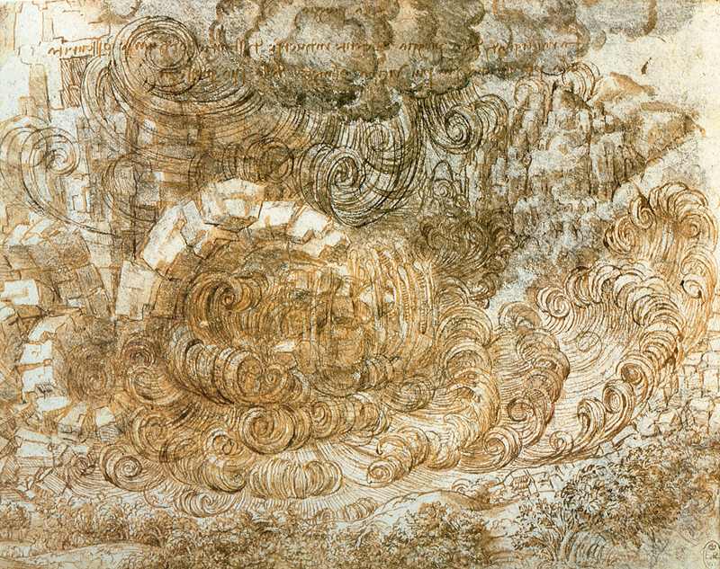

% An Exposition
% Leonardo da Vinci;Domenico Scarlatti

<<<<<<< HEAD
Leonardo's approach to science was observational: he tried to understand a phenomenon by describing and depicting it in utmost detail and did not emphasise experiments or theoretical explanation. Since he lacked formal education in Latin and mathematics, contemporary scholars mostly ignored Leonardo the scientist, although he did teach himself Latin. In the 1490s he studied mathematics under Luca Pacioli and prepared a series of drawings of regular solids in a skeletal form to be engraved as plates for Pacioli's book De divina proportione, published in 1509.

## Murals
=======
# ChucK Translator in python

I've written an extremely simple translator. It takes a LISP syntax and translates it into ChucK code.
The reason was that ChucK code was not brief enough for my composing needs. Programs resulting in complex music became quite quickly hard to follow even for the programmer himself.

I've chosen LISP since it is one of the easiest syntaxes to parse and doesn't have a lot of 'hair'.

Here's a first example of a piece of lisp.

    (step-gen
        (seq -1 1)
        (st 10))

text t2 3 1 { content2 
weave1 is a good weave
>>>>>>> 3489e4f088be9205e3af55f92bee7da13dc2b178

Leonardo's The Battle of Anghiara was a fresco commissioned in 1505 for the Salone dei Cinquecento (Hall of the Five Hundred) in the Palazzo Vecchio, Florence. Its central scene depicted four men riding raging war horses engaged in a battle for possession of a standard, at the Battle of Anghiari in 1440. At the same time his rival Michelangelo, who had just finished his David, was assigned the opposite wall. All that remains of Leonardo's work is a copy by Rubens, but Maurizio Seracini is convinced it can still be found and has spent a lifetime searching for it. He was allowed to drill some pilot holes in a mural in the Salone dei Cinquecento, Palazzo Vecchio, Florence, and his team did find evidence of an oil painting

## another weave 

**contains this**

[aud1](media/sonata.mp3)

